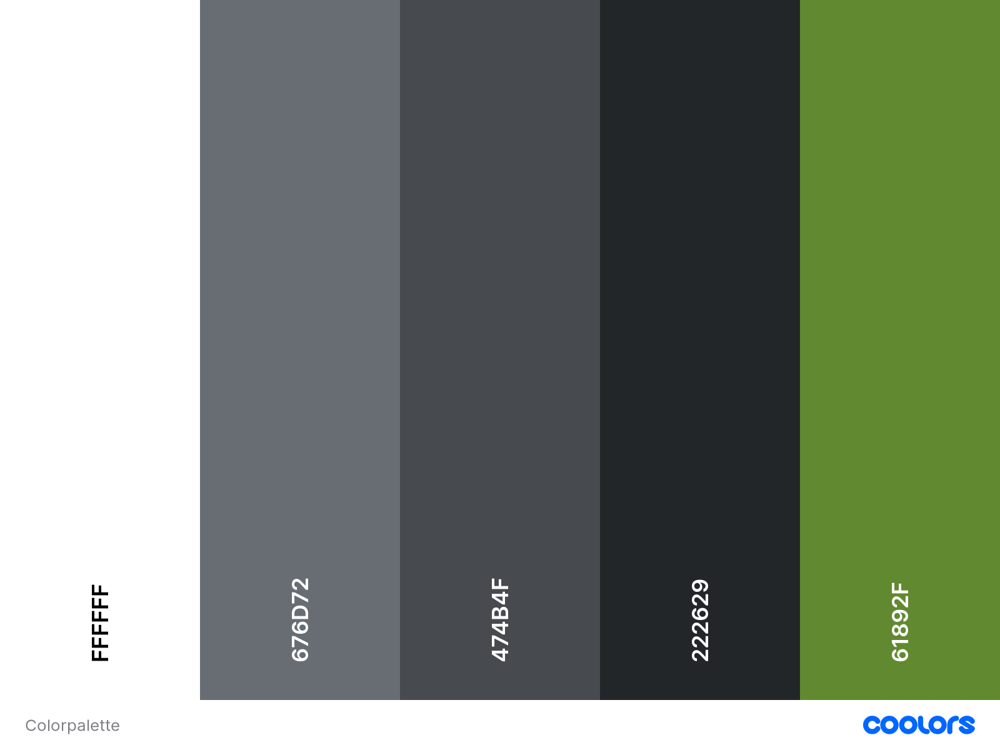

# T1A2 - Portofolio

## Coder Academy Term 1 Assignment 2

Student Name: Fabian Sugandhi\
[Website](https://fabiansugandhi-t1-a2.netlify.app/)\
[Github Repo](https://github.com/FabSugandhi/FabianSugandhi_T1A2/tree/main)

## Purpose

The purpose of this portofolio website is to represent me as a developer and IT professional. The website provides viewers with information regarding my background, skill, interests, and experience. It is essentially an interactive and expansive form of my resume, able to communicate and demonstrate more about my abilities to prospective clients and collaborators than the usually much more compact resume.

## Target Audience

The target audience for the website are employers looking to engage a developer and/or IT professional. They are expected to have industrial knowledge and expectations, including but not limited to: technical knowledge relating to IT, software development, programming languages, and development stacks. Additionally, as professional themselves, they will also have high expectations of professionalism and work ethic.

## Functionality/Features

The website is designed with the core principles of simplicity, boldness, and engagement. The multiple components of the website are engineered to be easily distinguishable for the viewers, while still keeping the main function of communicating the myriad of information explained in the "Purpose" section above. This is achieved through the manipulation of the website hierarchy and content, such as the headings, sections, typography, and colours.

While there are a lot of content that I would like to showcase, it is also very important to avoid overloading viewers with information, hence the consideration for this design concept that I decided on, which I will explain below.

First, the colour scheme. I have chosen a dark background colour ("Eerie Black #222629" for the body and "Outer Space #474B4F" for the navigation bar) complemented with contrasting-coloured fonts ("Avocado #61892F" and "White #FFFFFF", depending on the hierarchy) as headings to make them stand out, allowing the to viewers to easily skim through to find their desired content.\
For the parapraphs and informative texts, I have chosen a colour ("Dim Gray #676D72") darker than the headers to further highlight the difference in content hierachy; this colour, not standing out as prominently from the background, will draw more focus from the viewers while reading these texts.\
I believe this color scheme creates a dynamic engagement of attention, akin to the visual file system of the general computer OS, without actually having any folders present.\
The visual of the color pallette below.

Second, the typography. I have chosen a couple of font families for this website, "Bebas Neue" and "Oxygen", both of which are embedded in the <"head"> of the HTML document and preloaded.\
"Bebas Neue", being the bolder of the two, is the font family of choice for the majority of the website text, especially the headers. While "Oxygen" is used for the paragraps and informative texts. In my vision, the combination of these two font families creates an interesting contrast between the content hierarchy, working together with the colour scheme to create the dynamic mentioned in the previous paragraph.

Finally, the design and layout of the website pages. There are essentially two different designs for the website, one designed as eyecatcher (used in the "Home" page) and another designed as informative for the other pages. Both of these designs are equipped with the "Navigation Bar" to allow viewers to easily navigate between the different pages, with each link getting underlined on hover.\
The eyecatcher design is kept to a minimum, as its main function is to welcome viewers and provide a rough outlook of the website's visual. The font sizes in this design are intentionally set a larger size to help catch viewers' attention.\
The informative design, is intentionally set-up with a centered-column layout to allow viewers to scroll through and skim the pages to easily find the information they are seeking. This is achieved by utilising the content hierarchy of the design elements I mentioned previously.

Most of the pages have a button at the bottom of the page which takes viewer to the "Contact" page. This button is mainly targetted for invested viewers looking for a way to connect, giving them quick access to my contact information. There is also another button utilised in a couple of pages where my background and experience are concerned ("About" and "Experience" page), allowing viewers to download a copy of my resume. This resume is currently and outdated resume from my time in the previous industry, used as a placeholder and will be replaced in the future.

I also paid attention to the responsive functionality of the website. Since there are multiple devices with varying amount of screen sizes that will potentially view this website, I have included media queries to each of the pages. These queries customize the font sizes, image sizes, and even the content placement of some components of these pages, while still maintaining the centered-column layout identity of the website. I have prepared this website for 3 screen sizes: Mobile devices (up to 768px wide), Tablet (up to 1024px wide), and Laptop (covers the rest of general screen widths above 1024px).

Most of the formatting is contained in the style.css file to maintain uniformity between the pages. Including the general formatting and sizing for the HTML page component, text, margin, flex behaviour, layout (CSS Flexbox being the majority layout function), and media queries. I have added maximum sizes for several of the components as well as keeping minimum usage "vw" or "vh" for text sizes to avoid the content being too big for some device, keeping the centered column design. This might change in the future once I have analysed enough data of website visits. Each of the pages are linked to two stylesheets, "style.css" and one dedicated for each page. For some components that are specific to certain pages, such as images, there are extra styling applied on their dedicated stylesheet.

The website features five main pages and five blog post pages, with the latter being only accessible through the "Blog" page and betwen themselves to prevent the cluttering of the main pages and navigation bar. The unique contents of each page are further explained below.

### Homepage

The "Home" page is set to be as simple while still eyecatching as possible, being the landing page of the website, with very minor or no scrolling involved. It contains a centerpiece containing my name, title, and a brief introduction including my location to help viewers know from the get-go whether I am a potential client that fits their criteria. Should the viewer be interested in learning more about me, the page also contains a unique text that links to the "About" page, set at a different formatting directly below the introductory paragraph.

As mentioned if the previous section, the "Homepage" falls under a special design. The text components are set at a size larger then the rest of the website and are sized relative to the viewport to ensure they are scaled accurately to the viewers' screen size.

### About

The "About" page provides viewers with information about me, specifically my photo, professional background, relevant skills, and my personal interests and hobbies. These sections are chosen due to them being the general questions we asked about when getting to know about someone, such as during an interview. The list of professional skills are also currently limited by my understanding of the my current course syllabus at Coder Academy and will definitely change in the future.

### Experience

The "Experience", or as I put in the page header the "Experience and Qualification" page provides viewers with a brief history of my educational and professional backgrounds, as well as the list of projects that I have completed with links to the GitHub repository for each project. Currently, the only available project is the "Portofolio Website" project, the rest are just placeholders and will definitely be added in the future.

### Blog

The "Blog" page contains five components each with a hyperlink "Read Post" text to their respective "Blogpost" page. Each of these blog components consists of a blog image, title, published date, and a quick description of the blogpost content. All of these components are placeholders for the purpose of this assignment.

### Blogpost

There are five "Blogpost" pages, each links directly from the aforementioned "Blog" page and are not included in the Navigation menu to avoid cluttering the website. Each "Blogpost" page consists of the blog image, title, published date, and the actual blogpost article. Same as the above, all are placeholders for the purpose of this assignment.

Under the main content, I have also included a "Recent Posts" section which contains two components linked to the next and previous blog posts, with only the blog title and published date shown. For the most recent and oldest blog posts ("Blogpost 1" and "Blogpost 5"), there is only one "Recent Posts" component available as there no newer or older posts respectively.

### Contact

The "Contact" page contains a short friendly message and my contact information (email, phone, and residential area), as well as hyperlinked icons to my social media pages.